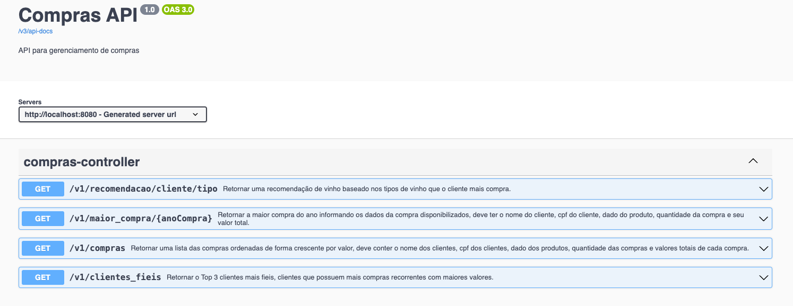
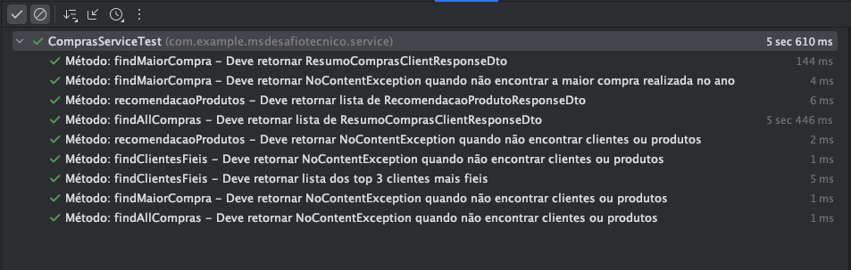

# Sistema de Votação de Associado
Sistema que permite a visualização de compras de clientes, com a possibilidade de visualizar a maior compra do ano, os clientes mais fiéis e uma recomendação de vinho baseado nos tipos de vinho que o cliente mais compra.

## Funcionalidades

- [x] GET: /compras - Retornar uma lista das compras ordenadas de forma crescente por valor, deve conter o nome dos clientes, cpf dos clientes, dado dos produtos, quantidade das compras e valores totais de cada compra.
- [X] GET: /maior-compra/ano - (Exemplo: /maior_compra/2016) - Retornar a maior compra do ano informando os dados da compra disponibilizados, deve ter o nome do cliente, cpf do cliente, dado do produto, quantidade da compra e seu valor total.
- [X] GET: /clientes-fieis - Retornar o Top 3 clientes mais fieis, clientes que possuem mais compras recorrentes com maiores valores.
- [X] GET: /recomendacao/cliente/tipo - Retornar uma recomendação de vinho baseado nos tipos de vinho que o cliente mais compra.

## Tecnologias
- Java 21
- Spring Boot 3
- Maven 3
- JUnit 5
- Mockito
- Swagger

## Execução
Para executar o projeto é necessário ter o Maven. Após isso, basta executar o comando abaixo na raiz do projeto:

```bash
mvn clean install
```

## Documentação
A documentação da API pode ser acessada através do link abaixo:
* [Swagger - http://localhost:8080](http://localhost:8080/swagger-ui.html)
<br>

## Testes Unitários
<br>
